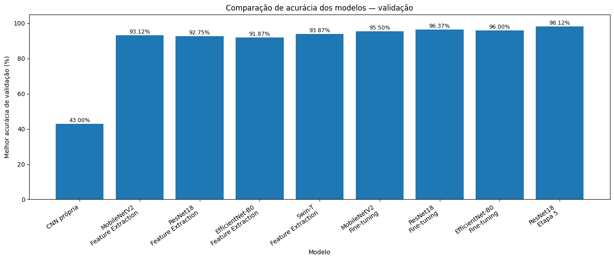
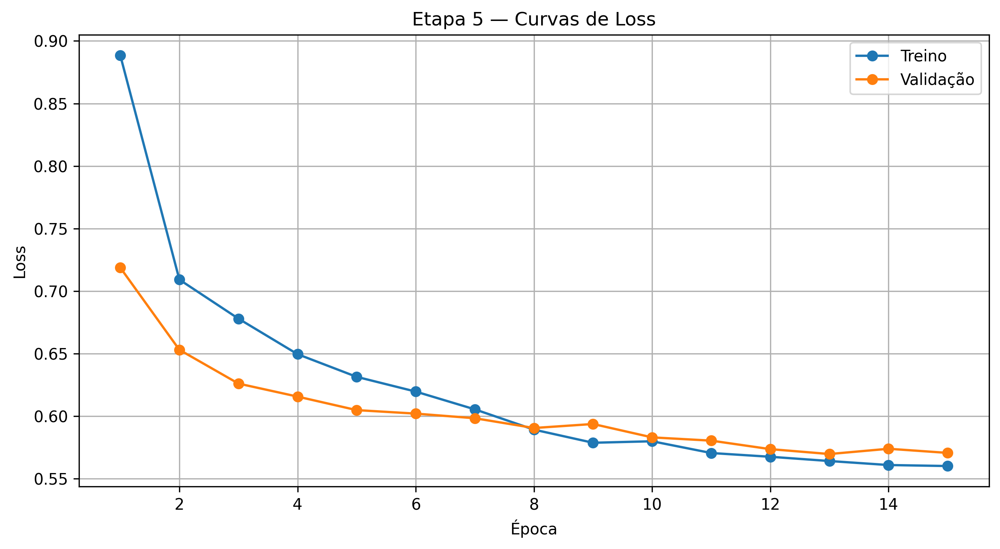
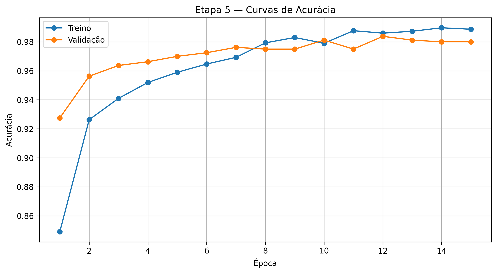
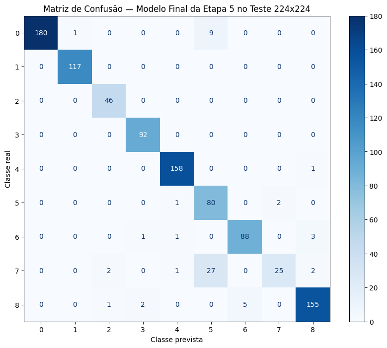
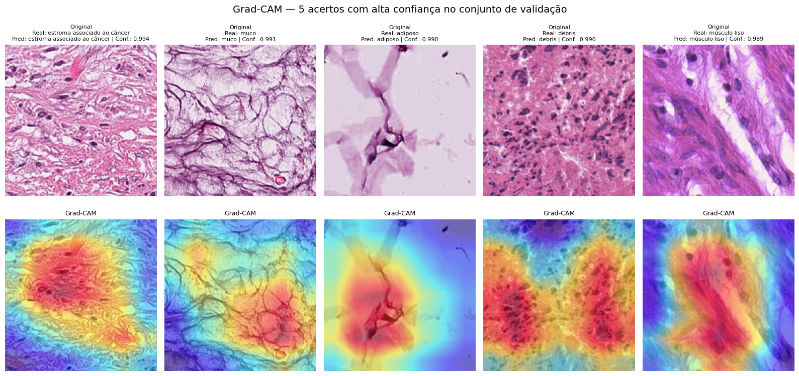
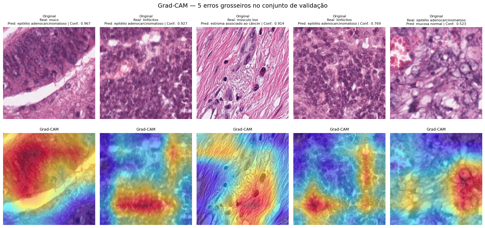
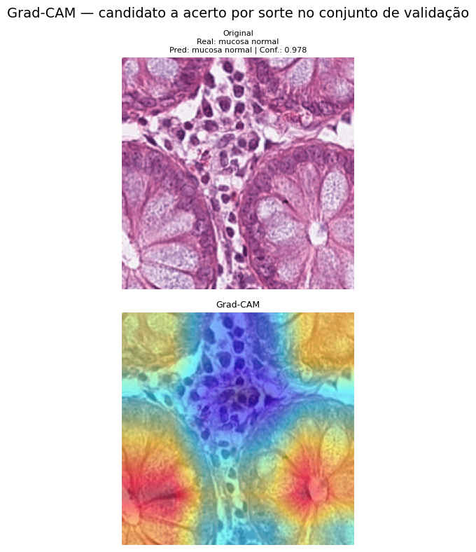
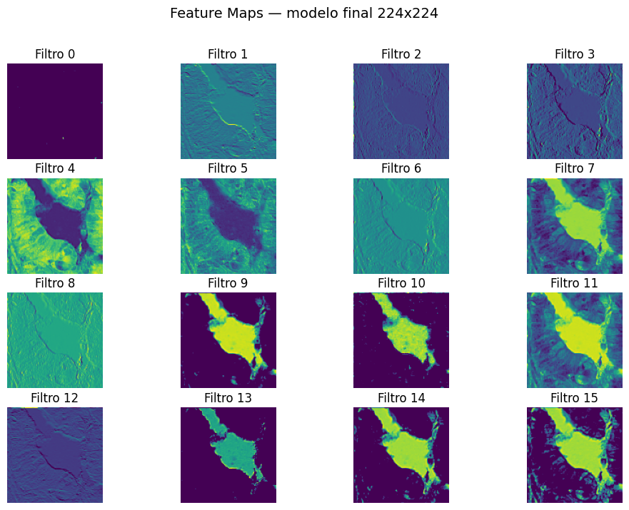

# Trabalho Final de Inteligência Artificial — Classificação de Tecidos Histopatológicos com PathMNIST

Projeto desenvolvido para o Trabalho Final da disciplina de Inteligência Artificial do curso de Sistemas de Informação da UniCatólica.

O objetivo é percorrer uma jornada prática que vai da implementação manual de uma rede neural em NumPy até o uso de arquiteturas modernas de visão computacional, transfer learning, fine-tuning, busca de hiperparâmetros e técnicas de explicabilidade aplicadas ao dataset PathMNIST.

Projeto finalizado com os resultados obtidos após a avaliação única do modelo final no conjunto de teste.

## Equipe

- Integrante 1: **Rafael Ângelo Meireles Azevedo**
- Integrante 2: **Luis Felipe Xavier Falcão**
- Integrante 3: **Victor Pinheiro de Lima**

## Artigo científico

- PDF do artigo: `report/relatorio.pdf`

## Dataset

O projeto utiliza o **PathMNIST**, da coleção MedMNIST, com 9 classes de tecidos histopatológicos relacionados ao câncer colorretal:

1. Adiposo
2. Fundo
3. Debris
4. Linfócitos
5. Muco
6. Músculo liso
7. Mucosa normal
8. Estroma associado ao câncer
9. Epitélio adenocarcinomatoso

Na Etapa 1, a versão 28×28 é utilizada apenas para a implementação matemática da MLP em NumPy.

A partir da Etapa 2, são utilizadas imagens reais da versão oficial **224×224**, sem redimensionar imagens 28×28. Devido à limitação de memória do Google Colab gratuito, foi utilizado um subconjunto real da versão 224×224, preservando os splits oficiais:

| Split | Quantidade | Resolução |
|---|---:|---:|
| Treino | 3.000 | 224×224 |
| Validação | 800 | 224×224 |
| Teste | 1.000 | 224×224 |

O conjunto de teste é mantido isolado e deve ser usado uma única vez, apenas após todas as decisões de modelo e hiperparâmetros terem sido tomadas com base na validação.

### Arquivos `.npz` do subconjunto 224×224

Os arquivos `.npz` do subconjunto 224×224 **não são versionados no GitHub** por tamanho. Eles estão disponíveis no Google Drive:

- [Pasta `pathmnist_sample_224` no Google Drive](https://drive.google.com/drive/folders/1BMgSCzEp8g5wvZ6-DWzx28kGmUJPNSWB?hl=pt-br)

A pasta contém:

- `train_sample_224.npz`
- `val_sample_224.npz`
- `test_sample_224.npz`

Para executar no **Google Colab**, mantenha os arquivos em:

```text
/content/drive/MyDrive/pathmnist_sample_224/
```

Para execução **local no VS Code**, os arquivos podem ser colocados em:

```text
notebooks/data/sample_224/
```

O notebook `05_criar_sample_224.ipynb` também permite recriar esses subconjuntos a partir do PathMNIST oficial 224×224. Porém, o carregamento completo da versão 224×224 pode exigir bastante memória RAM; caso ocorra `MemoryError`, recomenda-se usar os arquivos `.npz` já disponibilizados no Drive.

## Objetivos atendidos

- Implementar uma MLP do zero utilizando apenas NumPy.
- Implementar forward propagation, backpropagation, Softmax, Cross-Entropy e SGD com Momentum.
- Validar os gradientes com Gradient Checking.
- Criar uma MLP equivalente em PyTorch, com comparação controlada em relação à versão NumPy.
- Construir uma CNN própria com pelo menos três blocos convolucionais.
- Avaliar MobileNetV2, ResNet18 e EfficientNet-B0 em Feature Extraction e Fine-tuning parcial.
- Avaliar uma arquitetura baseada em atenção com Swin Transformer.
- Executar um grid de 2 otimizadores × 3 learning rates.
- Implementar uma Etapa 5 com augmentation, scheduler, regularização, early stopping, checkpoint e logs.
- Aplicar Feature Maps e Grad-CAM em imagens de validação.
- Avaliar o melhor modelo no conjunto de teste apenas uma vez.
- Gerar matriz de confusão 9×9 e relatório de classificação.

## Estrutura do repositório

```text
Project-AI-Final/
├── README.md
├── requirements.txt
├── .gitignore
├── checkpoints/
│   └── resnet18_etapa5_best.pth
├── data/
│   └── arquivos .npz não versionados
├── experiments/
│   └── etapa5_training_log.csv
├── figures/
│   ├── comparacao_acuracia.png
│   ├── etapa5_curvas_acuracia.png
│   ├── etapa5_curvas_loss.png
│   ├── feature_maps.png
│   ├── gradcam_acertos.png
│   ├── gradcam_erros.png
│   ├── gradcam_acerto_por_sorte.png
│   └── matriz_confusao.png
├── notebooks/
│   ├── 01_carregar_pathmnist.ipynb
│   ├── 02_numpy_mlp.ipynb
│   ├── 03_pytorch_validation.ipynb
│   ├── 04_cnns_and_vit.ipynb
│   ├── 05_criar_sample_224.ipynb
│   └── data/
│       └── sample_224/
│           ├── train_sample_224.npz
│           ├── val_sample_224.npz
│           └── test_sample_224.npz
└── report/
    └── relatorio.pdf
```

> Os arquivos `.npz` aparecem localmente em `notebooks/data/sample_224/`, mas não são enviados ao GitHub por causa do `.gitignore`. Para reproduzir o projeto, use o link do Google Drive informado na seção do dataset.

## Notebooks

### `01_carregar_pathmnist.ipynb`

Carregamento e visualização inicial do PathMNIST.

### `02_numpy_mlp.ipynb`

Implementação manual da MLP com NumPy:

- Preparação dos dados.
- One-hot encoding.
- ReLU e derivada.
- Softmax numericamente estável.
- Cross-Entropy.
- Forward propagation.
- Backpropagation.
- SGD com Momentum.
- Curvas de loss e acurácia.
- Gradient Checking com diferença relativa esperada menor que `10⁻⁵`.

### `03_pytorch_validation.ipynb`

Implementação da MLP equivalente em PyTorch:

- Mesmos dados, ordem de achatamento, seed, pesos iniciais e hiperparâmetros da versão NumPy.
- Comparação controlada após 20 épocas.
- Verificação automática da diferença de acurácia em pontos percentuais.

### `04_cnns_and_vit.ipynb`

Notebook principal das etapas avançadas:

- Carregamento do sample real 224×224.
- CNN própria.
- MobileNetV2, ResNet18 e EfficientNet-B0 em Feature Extraction.
- MobileNetV2, ResNet18 e EfficientNet-B0 em Fine-tuning parcial.
- Swin Transformer.
- Grid de SGD com Momentum e AdamW usando learning rates `1e-2`, `1e-3` e `1e-4`.
- Etapa 5 com data augmentation moderado, label smoothing, weight decay, scheduler cosseno e early stopping.
- Salvamento de resultados, logs e checkpoint.
- Grad-CAM em validação: 5 acertos com alta confiança, 5 erros grosseiros e 1 candidato a acerto por sorte.
- Feature Maps.
- Única avaliação final no conjunto de teste.
- Matriz de confusão 9×9 e relatório de classificação.

### `05_criar_sample_224.ipynb`

Criação dos subconjuntos reais da versão oficial 224×224, preservando os splits oficiais de treino, validação e teste.

## Modelos avaliados

| Modelo | Estratégia |
|---|---|
| MLP NumPy | Implementação manual |
| MLP PyTorch | Treino do zero e equivalência controlada |
| CNN própria | Treino do zero |
| MobileNetV2 | Feature Extraction e Fine-tuning parcial |
| ResNet18 | Feature Extraction e Fine-tuning parcial |
| EfficientNet-B0 | Feature Extraction e Fine-tuning parcial |
| Swin-T | Feature Extraction |
| ResNet18 Etapa 5 | Fine-tuning parcial com otimização avançada |

## Grid de hiperparâmetros

O grid compara duas estratégias de otimização em condições controladas:

| Otimizador | Learning Rates |
|---|---|
| SGD com Momentum | `1e-2`, `1e-3`, `1e-4` |
| AdamW | `1e-2`, `1e-3`, `1e-4` |

Cada combinação começa com uma nova ResNet18 pré-treinada, usa a mesma seed, os mesmos dados e o mesmo número de épocas. A melhor configuração é escolhida exclusivamente pela validação.

## Etapa 5 — Desafio Final

A Etapa 5 utiliza a melhor configuração do grid e combina:

- Data augmentation moderado.
- Fine-tuning parcial da ResNet18.
- Label smoothing.
- Weight decay.
- Scheduler `CosineAnnealingLR`.
- Early stopping.
- Salvamento do melhor checkpoint pela menor loss de validação.
- Logs por época em CSV.

As transformações geométricas e de cor foram mantidas moderadas para evitar distorções excessivas nas características histológicas.

## Explicabilidade

### Grad-CAM

O Grad-CAM é aplicado exclusivamente em imagens do conjunto de validação. A seleção inclui:

- 5 acertos com maior confiança.
- 5 erros grosseiros com maior confiança na classe errada.
- 1 candidato a acerto por sorte, identificado por uma heurística de atenção concentrada nas bordas.

Os mapas devem ser analisados visualmente para verificar se o modelo concentra atenção em regiões teciduais relevantes ou em fundo, bordas e artefatos.

### Feature Maps

Os Feature Maps das primeiras camadas convolucionais permitem observar ativações associadas a bordas, texturas, contrastes e variações de intensidade. Essas representações simples são combinadas nas camadas mais profundas para formar padrões mais complexos relacionados às classes histopatológicas.

## Resultados e artefatos

Os resultados completos estão nos outputs do notebook `04_cnns_and_vit.ipynb` e nos arquivos salvos no repositório:

- `experiments/etapa5_training_log.csv`: histórico detalhado da Etapa 5.
- `checkpoints/resnet18_etapa5_best.pth`: melhor checkpoint da Etapa 5 selecionado pela menor loss de validação.
- `figures/`: figuras usadas no README e no relatório.

As tabelas consolidadas dos demais modelos e do grid aparecem nos outputs do notebook `04_cnns_and_vit.ipynb`.

### Principais resultados de validação

| Modelo | Estratégia | Melhor acurácia de validação |
|---|---|---:|
| CNN própria | Treino do zero | 43,00% |
| MobileNetV2 | Feature Extraction | 93,12% |
| ResNet18 | Feature Extraction | 92,75% |
| EfficientNet-B0 | Feature Extraction | 91,87% |
| Swin-T | Feature Extraction | 93,87% |
| MobileNetV2 | Fine-tuning parcial | 95,50% |
| ResNet18 | Fine-tuning parcial | 96,37% |
| EfficientNet-B0 | Fine-tuning parcial | 96,00% |
| ResNet18 Etapa 5 | Fine-tuning + augmentation + regularização | 98,12% |



### Curvas da Etapa 5

As curvas abaixo mostram a evolução do modelo final durante a Etapa 5, com data augmentation, label smoothing, weight decay, scheduler cosseno e early stopping.





### Resultado final no teste

> O conjunto de teste foi utilizado uma única vez, apenas após a escolha do modelo final com base no conjunto de validação. Após observar esse resultado, o modelo, os hiperparâmetros e as transformações não foram mais alterados.

| Modelo Final | Acurácia no Teste | Loss no Teste |
|---|---:|---:|
| ResNet18 Etapa 5 | 93,90% | 0.6897 |



A principal dificuldade observada no teste ocorreu na classe **estroma associado ao câncer**, que apresentou maior confusão com tecidos visualmente semelhantes. Esse comportamento reforça a importância da análise qualitativa por matriz de confusão e Grad-CAM, principalmente em um problema histopatológico com classes morfologicamente próximas.

### Explicabilidade visual

O Grad-CAM foi aplicado em imagens do conjunto de validação, incluindo acertos de alta confiança, erros grosseiros e um candidato a acerto por sorte. Os Feature Maps foram extraídos da primeira camada convolucional do modelo final para visualizar padrões iniciais aprendidos pela rede, como bordas, texturas e variações de intensidade.

#### Grad-CAM — acertos com alta confiança



#### Grad-CAM — erros grosseiros



#### Grad-CAM — candidato a acerto por sorte



O candidato a acerto por sorte foi incluído para analisar casos em que a predição final está correta, mas a atenção visual pode se concentrar em regiões periféricas, bordas ou áreas menos representativas do tecido.

#### Feature Maps



## Reprodutibilidade

A seed utilizada nos notebooks é:

```text
SEED = 42
```

As seeds são fixadas para:

- `random`
- `numpy`
- `torch`
- `torch.cuda`, quando disponível

Os experimentos foram executados nos seguintes ambientes:

### Ambiente local

- Sistema operacional: Windows
- Editor: Visual Studio Code
- Python: 3.12
- Processador: Intel Core i5 de 10ª geração
- Memória RAM: 8 GB

### Ambiente em nuvem

- Google Colab
- GPU: NVIDIA T4
- VRAM: aproximadamente 15 GB

## Como executar

### 1. Clonar o repositório

```bash
git clone https://github.com/rafaelxde/Project-AI-Final.git
cd Project-AI-Final
```

### 2. Criar e ativar um ambiente virtual

```bash
python -m venv .venv
```

Windows PowerShell:

```powershell
.venv\Scripts\Activate.ps1
```

Caso o PowerShell bloqueie a ativação:

```powershell
Set-ExecutionPolicy -Scope Process -ExecutionPolicy Bypass
.venv\Scripts\Activate.ps1
```

Linux ou macOS:

```bash
source .venv/bin/activate
```

### 3. Instalar as dependências

```bash
pip install -r requirements.txt
```

### 4. Preparar os dados 224×224

Baixe os três arquivos `.npz` da pasta do Google Drive:

- [Pasta `pathmnist_sample_224` no Google Drive](https://drive.google.com/drive/folders/1BMgSCzEp8g5wvZ6-DWzx28kGmUJPNSWB?hl=pt-br)

Para rodar no Colab, mantenha-os em:

```text
/content/drive/MyDrive/pathmnist_sample_224/
```

Para rodar localmente, coloque-os em:

```text
notebooks/data/sample_224/
```

### 5. Executar os notebooks

Ordem recomendada:

1. `01_carregar_pathmnist.ipynb`
2. `02_numpy_mlp.ipynb`
3. `03_pytorch_validation.ipynb`
4. `05_criar_sample_224.ipynb`
5. `04_cnns_and_vit.ipynb`

No notebook `04_cnns_and_vit.ipynb`, execute:

1. Modelos e fine-tunings.
2. Grid de hiperparâmetros.
3. Etapa 5.
4. Salvamento de resultados, logs e checkpoint.
5. Grad-CAM e Feature Maps.
6. Avaliação final no teste, apenas uma vez.

## Observação sobre checkpoints

O checkpoint final disponível no repositório é:

```text
checkpoints/resnet18_etapa5_best.pth
```

Caso o arquivo ultrapasse o limite permitido pelo GitHub em alguma versão futura, ele deverá ser disponibilizado por link externo e o README deverá ser atualizado.

## Uso de Inteligência Artificial Generativa

Durante o desenvolvimento, o ChatGPT foi utilizado como apoio para:

- Organização das etapas do projeto.
- Explicação de conceitos.
- Auxílio na depuração de erros.
- Estruturação e revisão dos notebooks.
- Revisão da documentação.
- Apoio na implementação de controles de reprodutibilidade.

Todo o código foi executado, analisado e adaptado pela equipe. A equipe deve ser capaz de explicar e modificar qualquer trecho apresentado.

## Limitações

- Os experimentos avançados utilizam um subconjunto real da versão 224×224 devido à limitação de memória do ambiente gratuito.
- Os arquivos `.npz` do subconjunto 224×224 não são versionados no GitHub, mas são disponibilizados via Google Drive.
- O desempenho pode variar em execuções futuras, apesar da fixação de seeds.
- Grad-CAM fornece evidências visuais úteis, mas não garante validade clínica.
- O modelo deve ser interpretado como ferramenta de apoio e não como substituto da avaliação médica especializada.
